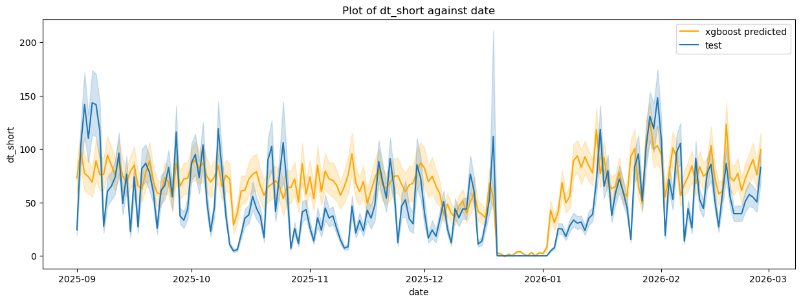
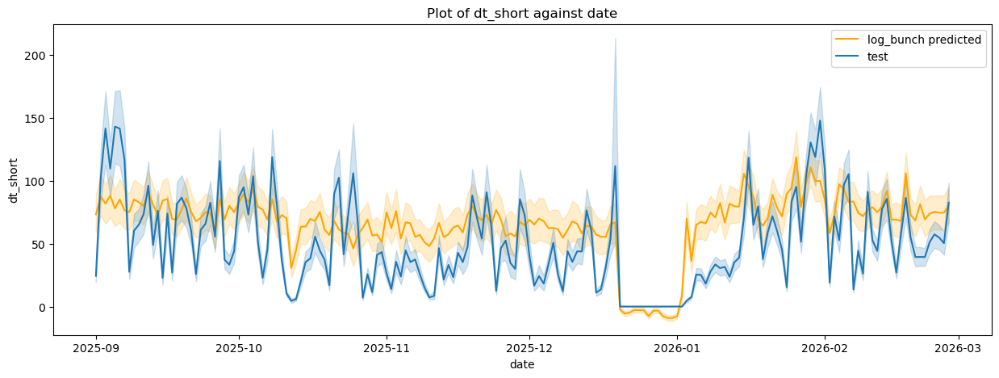

# Predicting and Understanding Streetcar Delays in Toronto 
This is a project hosted by the Erdos institute's [Data Science Boot camp](https://www.erdosinstitute.org/programs/spring-2026/data-science-boot-camp), which we completed in around a 6 week period.

## Introduction/Motivation/Overview

According to [this Urgency Statement](https://www.toronto.ca/legdocs/mmis/2025/ttc/bgrd/backgroundfile-253360.pdf) by the Toronto Transit Commission (TTC), the TTC is in urgent need for improvement. Annually, the TTC carries over 1.4 million trips a day, 70% of which consist of bus and streetcars. One important point that the statement brings up is the rising cost of congestion on the TTC, with an estimated 60 million dollars in cost for the TTC since 2019. 

It is well known that streetcars for the TTC in particular are dreadfully slow. For example, the [following application](https://ttcleaderboard.vercel.app/) shows a live preview of streetcars in operation, as a criticism of the slow service of our vehicles. This has been on the public mindset recently, as the Fifa world cup is set to happen in Toronto this summer, [causing concerns on how the TTC will address these congestion problems](https://globalnews.ca/news/11580546/toronto-world-cup-traffic-impact/).

In this project, we look at the effect of gridlocked streetcars on delay time. We specifically look at a feature 
that we call **bunching events**, motivated by [a pilot program by the TTC](https://www.toronto.ca/legdocs/mmis/2025/ttc/bgrd/backgroundfile-259672.pdf).
We focus specifically on route 506, a busy east-west streetcar line that gives a representative of traffic congestion in Toronto. 

## Data Description
Raw data can be found in [raw_data](raw_data/)

1. **Streetcar Scheduling Data**: collected by scraping from [TransSee](https://www.transsee.ca/), which contains historical and up-to-date real time information about TTC vehicles. Data was collected per stop on the 506 line from 2024-07-30 to 2026-02-27. For each stop, direction, and vehicle, the dataset includes both scheduled and observed service information including: actual arrival time along with minutes ahead or behind schedule, scheduled headway between vehicles (corresponding to the expected time of arrival of subsequent vehicles at a stop), and the observed headway (the time difference between consecutive streetcar arrivals at a stop)

2. **Weather Data**: provided by [Weatherstats Canada](https://toronto.weatherstats.ca/download.html), based on Environment and Climate Change Canada, containing daily weather information for the time period scraped by TransSee. 

#### Data Processing
Notebooks for processing data found in [data_processing](data_processing/) and the processed data can be found in [data/schedule_data](data/schedule_data/).

We aggregate the raw data into a daily, stop-level data set. For each (date, stop, direction) combination, we compute: 
- `bunch`: number of incidents where the space between two streetcars was less than 2 minutes. 
- `gap`: number of incidents where the space between two streetcars was more than 19 minutes. 
- `dt_short`: the total accumulated minutes of cars that were delayed between 5 minutes and 19 minutes (the 'non-extreme' delays).
- `dt_long`: the total accumulated minutes of cars that were delayed over 19 minutes (the 'extreme' delays).

Bunch and gap periods were chosen due to the [Pilot study](https://www.toronto.ca/legdocs/mmis/2025/ttc/bgrd/backgroundfile-259672.pdf) mentioned in the introduction on these types of incidents  
affecting punctuality.
As well, `dt_short` is chosen to account for these 'non-punctual' and 'non-extreme' delays.

We removed data points where there are long stretches of missing data points. We also remove extremely large gaps (longer than 2 hours), as this suggests a cancellation rather than a delay. 
 
Weather data points are merged by date, and for the amount of snow on the ground, we set missing values to 0. 

## Modelling Approach 
Notebooks for training and testing the models can be found in [models](models/). 

The modelling approach in this project uses both **linear regression** and **XGBoost** to examine the relationship between operational and environmental features and accumulated delay time. 

The focus of our approach is not only on predictive accuracy, but also on interpretability. One central goal is to use the model results to understand the potential impact of reducing bunching and improving operations. 

**Linear regression** was chosen as a primary modelling approach because it gives an interpretable framework for quantifying relationships within the data. In particular, it allows us to estimate the effect of bunching incidents on accumulated delay time and compare the relative importance of different features. Additionally, linear regression gives results that can be easily communicated to non-technical stakeholders and policymakers. 

For comparison, we also consider an **XGBoost model** using the same targets and features. We use **SHAP values** to examine feature importance and for interpretability of the model.

While **XGBoost** is likely to improve predictive accuracy/performance, it is less directly interpretable so we include both in our final analysis. 

#### Target Variable: 
We separate the accumulated delay times daily at each stop into the categories of short delays and long delays to capture two different dynamics. For our model we focus on short delay times in order to better capture the different factors that impact minor daily inefficiencies. 

#### Feature Selection: 
During model selection/development, we considered different subsets of the features and compared the performance.

Additionally, exploratory data analysis showed that delay variables showed high variance and non-linear relationships when compared to bunching. To address this, we evaluated the models with several logarithmic transformations of the number of bunching incidents and the delay times for both long and short delays: 

delay ~ bunch + features

delay ~ log(bunch) + features

log(delay) ~ log(bunch) + features

#### Validation strategy: 
To compare model performance and avoid time leakage, we used a **time series cross validation** approach. The training data was split into 5 chronological folds preserving the time ordering of the data. 

After choosing the transformations that performed the best we applied **Lasso and Ridge regression** to those models. However, this didn't significantly improve performance. Additionally, removing subsets of the features resulted in only minor changes in performance. Together, these suggest that the model is stable with the selected features. For this reason, we chose to keep the unregularized models with the full feature set.

## Results

| Model    | $RMSE$ | $R^2$ |
| -------- | ------ | ----- |
| baseline | 90.77  | 0.09  |
| xgboost  | 72.0   | 0.43  |
| ols      | 73.32  | 0.41  |

Here the baseline predicts the mean delay at each stop in each direction. The Final $R^2$ score of our model came 
out to around 42% for both the XGBoost and linear regression model compared to 9% for a baseline model. Although 
predicting net delay time from just this information is quite volatile, our results demonstrate that there is some 
predictive power in using bunch events to predict delay times. Our RMSE also went down from the baseline by 20%, 
showing a tighter margin for error in those predictions best described by our model. A plot of delay vs date of our 
model is given below:

## Future Directions
Due to limitations of time as well as our data set, many features which may contribute to a better predictor were not considered, and we believe it would be interesting for later projects to look at the following:
- Additional data beyond 2024-07-30 could provide more seasonality effects, allowing for a more robust analysis of delay time, and possibly provide a model for extreme delays as well. 
- Adding in information about alerts and interruptions on the line would be expected to improve the model further, helping narrow down exactly how influential bunching events are to predicting delays. 
- Case studies of high traffic events such as the upcoming FIFA world cup would provide additional insight into bunching events and delays.

